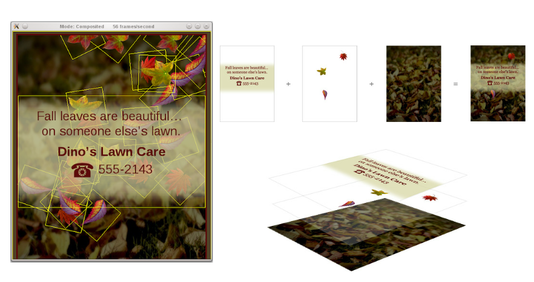
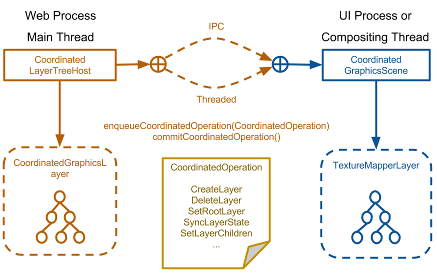

# Accelerated compositing in WebKit: Now and in the future

----

## Who am I?

- Gwang Yoon Hwang
- Hacker in Igalia, S. L.
- Working on WebKit Project, focused on rendering performance of WebKitGTK+ in embedded environment

----

# Accelerated Compositing

----

----

## Unfortunatly, it was not enough

- The main-thread is always busy (Parsing, Layout, JS ...)
- The main-thread can be blocked by VSync
- And we want awesome webpages which uses HTML5 features

----

# Off-the-main-thread Compositing

----

----

## Compositing in the dedicated thread / or process

- The main-thread don't have to care about Vsync and compositing operations
- It shows more smooth CSS animations, zoom, and scale operations.

----

## What we are (going to) using: Coordinated Graphics

- It implement a dedicated compositing thread in WebProcess or UIProcess.
- Depends on OpenGL[ES] only: Easy to port to other enviroment

----

----

## Unfortunatly, it is not enough

- Texture Uploading: Upload rasterized bitmaps to textures for normal contents
- texture to texture copy: Pass rendered results from WebGL or Canvas to the compositor
- Even worse if we need to share textures across processes

----

# Toward to Zero-Copy Compositing in WebKitGTK+

----

## Reduce texture uploading

- We can rasterize contents to textures if we are using cairo-gl
- However, it is not silver bullet
- For example: if you render a webpage with complex asian characters..
- Needs more investigations and tests

----

## Remove texture copy

- We can remove copies in Coordinated Graphics with Threaded mode (a.k.a. Threaded Compositor)
- For HTML5 Video and HTML5 WebGL, we don't have to use copy operations at all.
- For HTML5 2D Canvas, we need to preserve copy operation to support accumulated rendering.

----

----

# Current Status and Future

----

- You can build WebKitGTK+ with a --threaded-compositor flag
- However, It doesn't support WebGL, Canvas and Video yet
- Most of codes to support those features are ready, however we need to test it seriously before using it as a default

----

# Thank You!
