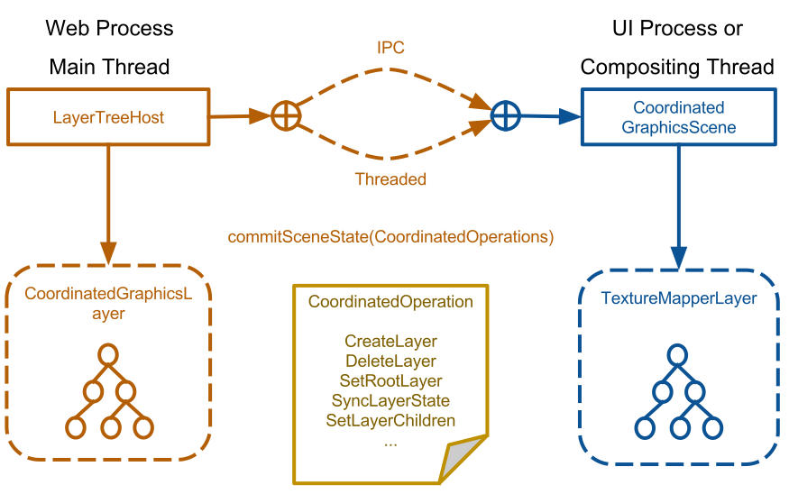

# Accelerated compositing in WebKit: Now and in the future
Gwang Yoon Hwang, yoon@igalia.com
----

## Who am I?

- Gwang Yoon Hwang
- Hacker in Igalia, S. L.
- Working on WebKit Project, focused on rendering performance of WebKitGTK+ in embedded environment

----

# Before we begin
###What is the Compositing?

----

If we have a single backing store, we need to redraw almost everything for each frame

If green and red have their own backing stores, then nothing needs "re-rasterizing" while this example animates.
<!-- .element: class="fragment" -->

<iframe data-src="./examples/simple-animation.html" width="100%" height="800px" clss="stretch"></iframe>

----

## Compositing
### The use of multiple backing stores to cache and group chunks of the render tree.
<small>From Shawn Singh's talk: https://docs.google.com/presentation/d/1dDE5u76ZBIKmsqkWi2apx3BqV8HOcNf4xxBdyNywZR8</small>

----

## Steps for Rendering
- Parsing: Nodes to DOM Tree
- Constructing RenderObject Tree to RenderLayer Tree

----

### Parsing: Creates the DOM Tree from source

<small>From: https://developers.google.com/web/fundamentals/performance/critical-rendering-path/
 Under the Creative Commons Attribution 3.0 Licenses</small>

----

### Creates the Render Tree from the DOM and the CSSOM

<small>From: https://developers.google.com/web/fundamentals/performance/critical-rendering-path/
 Under the Creative Commons Attribution 3.0 Licenses</small>

----

### Creates the GraphicsLayer Tree and Composite it to the screen

----

## Accelerate Compositing
- Do not have to re-rasterize entire page for each animated frame
 - Rasterization is expensive operation

- Composite page layers on the GPU can achieve far better efficiency than the CPU
 - GPU is specialized to handle large number of pixels

- Provide more efficent/practical ways to support features
  - Scrolling, 3D CSS, opacity, filters, WebGL, hardware video decoding, etc.

----

## This is not the focus of this talk

----

## Unfortunately, we still have problems

- The main-thread is always busy (Parsing, Layout, JS ...)
- The main-thread can be blocked by VSync
- And we want awesome webpages which uses HTML5 features

----

## Example: If we have layout operations during a animation
<iframe data-src="./examples/animation-with-layout.html" width="100%" height="900px" clss="stretch"></iframe>

----

## Timeline of the previous example: Best Case

----

## Timeline of the previous example: Worse Case

----

## Timeline of the previous example: Even Worse Case

----

# Off-the-main-thread Compositing

----

<!-- .element: class="stretch" -->

----

## Compositing in the dedicated thread / or process

- The main-thread don't have to care about Vsync and compositing operations
- It shows more smooth CSS animations, zoom, and scale operations.

----

## What we are (going to) using: Coordinated Graphics

- It implement a dedicated compositing thread in WebProcess or UIProcess.
- Depends on OpenGL[ES] only: Easy to port to other enviroment

----

----

## Let's compare

----

## Unfortunatly, it is not enough

- Texture Uploading: Upload rasterized bitmaps to textures for normal contents
- texture to texture copy: Pass rendered results from WebGL or Canvas to the compositor
- Even worse if we need to share textures across processes

----

# Toward to Zero-Copy Compositing in WebKitGTK+

----

## Reduce texture uploading

- We can rasterize contents to textures if we are using cairo-gl
- However, it is not silver bullet
- For example: if you render a webpage with complex asian characters..
- Needs more investigations and tests

----

## Remove texture copy

- We can remove copies in Coordinated Graphics with Threaded mode (a.k.a. Threaded Compositor)
- For HTML5 Video and HTML5 WebGL, we don't have to use copy operations at all.
- For HTML5 2D Canvas, we need to preserve copy operation to support accumulated rendering.

----

<!-- .element: class="stretch" -->

----

# Current Status and Future

----

- You can build WebKitGTK+ with a --threaded-compositor flag
- However, It doesn't support WebGL, Canvas and Video yet
- Most of codes to support those features are ready, however we need to test it seriously before using it as a default

----

# Thank You!
